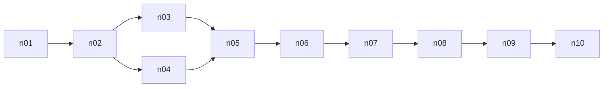
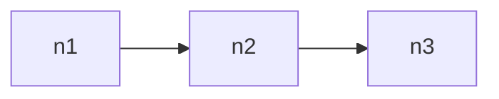
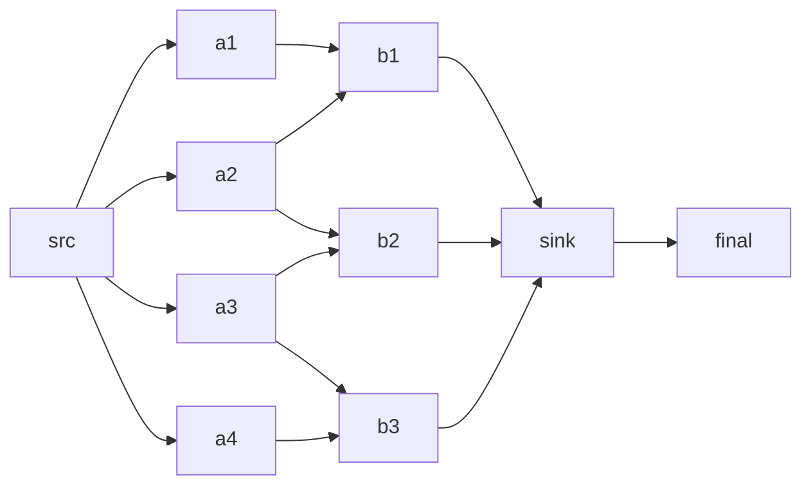
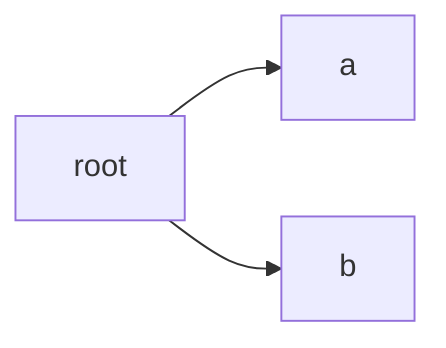
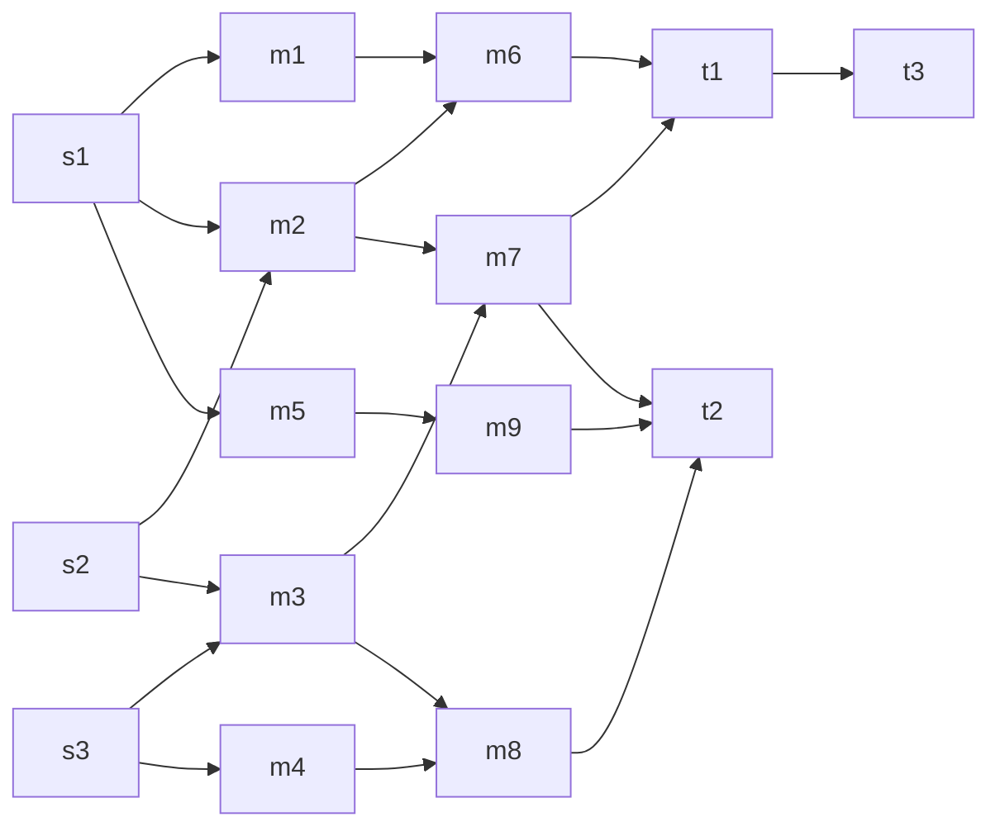
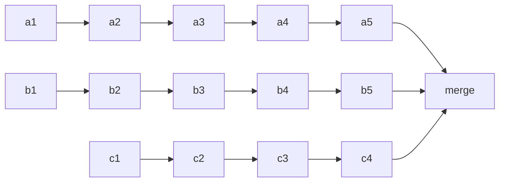
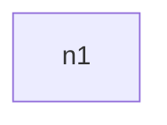
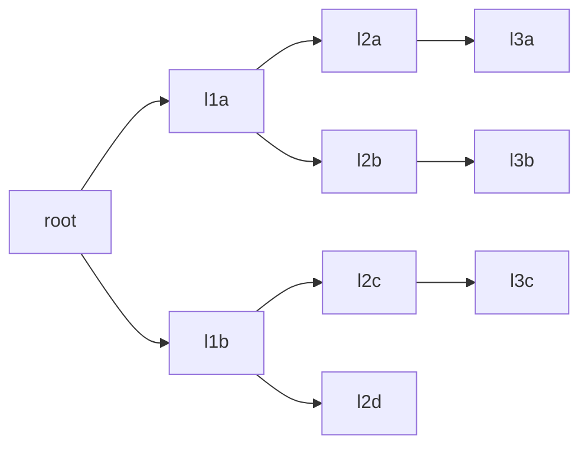
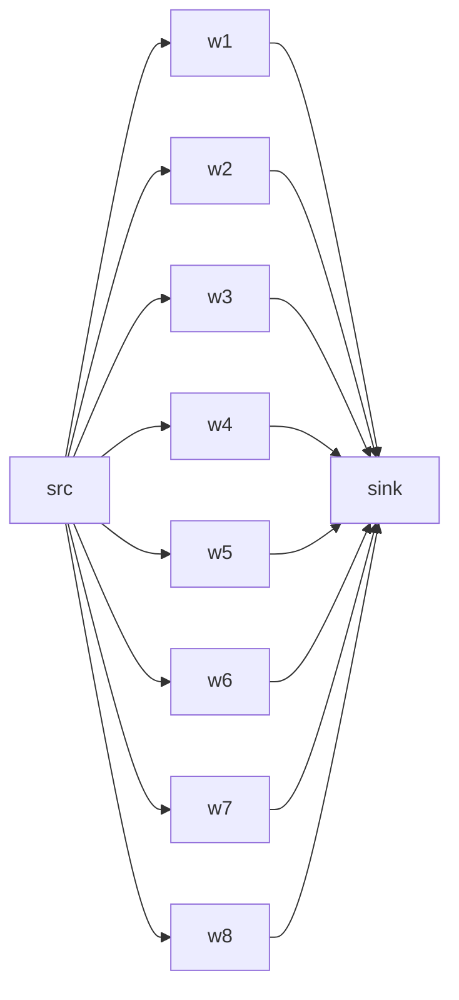

# Test DAG Topologies

## td_chain10_slack (10 nodes)

## td_chain3_slack (3 nodes)

## td_diamond10_mixed (10 nodes)

## td_fan3_mixed (3 nodes)

## td_layered100_slack (100 nodes)

```mermaid
graph LR
    a00 --> j16
    a00 --> j22
    a01 --> j07
    a01 --> j23
    a02 --> j00
    a02 --> j07
    a02 --> j24
    a03 --> j22
    a04 --> j03
    a04 --> j04
    a04 --> j06
    a04 --> j08
    a04 --> j19
    a05 --> j17
    a06 --> j02
    a07 --> j04
    a07 --> j06
    a07 --> j23
    a08 --> j00
    a08 --> j11
    a09 --> j15
    a09 --> j18
    a10 --> j14
    a10 --> j21
    a11 --> j06
    a11 --> j19
    a11 --> j22
    a12 --> j00
    a12 --> j10
    a13 --> j05
    a13 --> j09
    a13 --> j15
    a14 --> j03
    a14 --> j16
    a15 --> j02
    a16 --> j11
    a16 --> j17
    a17 --> j11
    a17 --> j13
    a17 --> j20
    a18 --> j01
    a18 --> j05
    a18 --> j23
    a19 --> j10
    a19 --> j21
    a20 --> j02
    a20 --> j03
    a20 --> j08
    a20 --> j14
    a20 --> j18
    a21 --> j09
    a21 --> j12
    a21 --> j13
    a22 --> j01
    a23 --> j04
    a23 --> j05
    a23 --> j12
    a23 --> j24
    a24 --> j07
    a24 --> j14
    a24 --> j17
    a24 --> j20
    j02 --> k01
    j04 --> k05
    j04 --> k06
    j05 --> k10
    j08 --> k11
    j13 --> k14
    j15 --> k00
    j15 --> k08
    j16 --> k12
    j17 --> k03
    j17 --> k09
    j19 --> k13
    j21 --> k07
    j24 --> k02
    j24 --> k04
    s00 --> t03
    s00 --> t05
    s00 --> t08
    s00 --> t14
    s01 --> t00
    s01 --> t01
    s01 --> t12
    s01 --> t16
    s01 --> t19
    s02 --> t09
    s02 --> t23
    s03 --> t01
    s03 --> t04
    s03 --> t10
    s03 --> t21
    s03 --> t24
    s04 --> t03
    s04 --> t19
    s04 --> t20
    s05 --> t00
    s05 --> t10
    s05 --> t11
    s05 --> t13
    s05 --> t18
    s05 --> t22
    s06 --> t02
    s06 --> t15
    s06 --> t22
    s07 --> t07
    s07 --> t11
    s08 --> t02
    s08 --> t06
    s08 --> t15
    s09 --> t17
    t01 --> a22
    t01 --> a24
    t02 --> a03
    t05 --> a06
    t05 --> a10
    t07 --> a09
    t07 --> a17
    t07 --> a23
    t08 --> a13
    t10 --> a19
    t12 --> a12
    t14 --> a11
    t17 --> a07
    t17 --> a16
    t19 --> a04
    t20 --> a02
    t20 --> a05
    t20 --> a14
    t21 --> a01
    t21 --> a18
    t22 --> a00
    t22 --> a15
    t23 --> a08
    t24 --> a20
    t24 --> a21
```

## td_mesh15_mixed (15 nodes)

## td_pipeline15_slack (15 nodes)

## td_solo_heavy (1 nodes)

## td_solo_light (1 nodes)

## td_tree10_mixed (10 nodes)

## td_wide10_slack (10 nodes)

**11 DAGs, 178 total models.**
